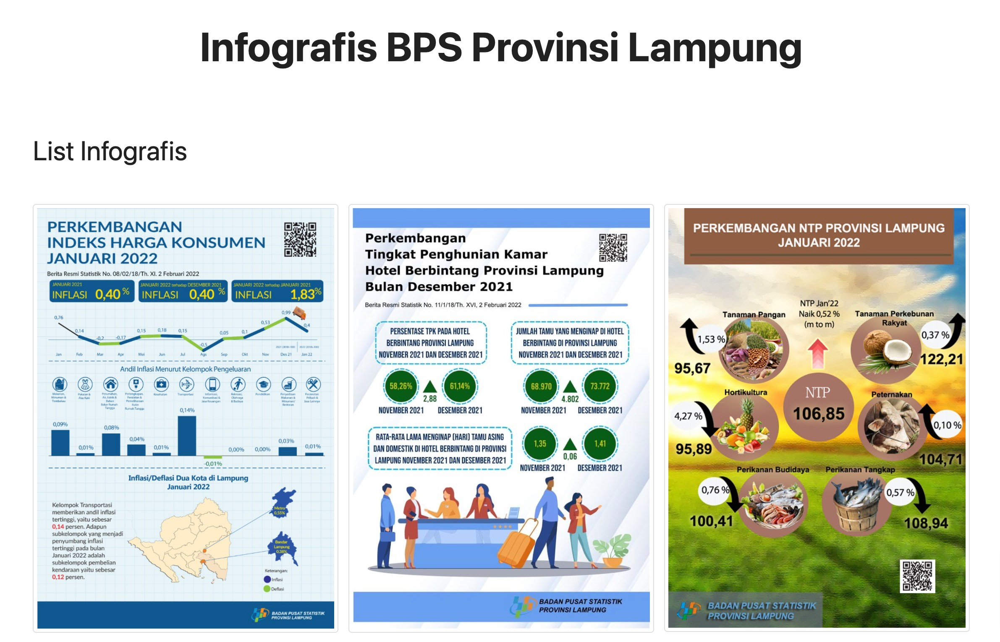

# Studi Kasus Penggunaan API BPS

Apabila sudah mendaftarkan akun pada laman [WebAPI BPS](https://webapi.bps.go.id) dan juga mendaftarkan aplikasi yang akan dibangun/dikembangkan, serta membaca dokumentasi dari API tersebut di laman [Dokumentasi API BPS](https://webapi.bps.go.id/documentation), maka kita sudah siap untuk mengimplementasikan API tersebut dalam aplikasi yang kita ingin bangun/kembangkan.

Berikut ini adalah contoh studi kasus sederhana cara mengkonsumsi API BPS, khususnya untuk `infografis` BPS Provinsi Lampung.

## Infografis BPS Provinsi Lampung

Pada kode Javascript di bawah ini, saya membuat variabel `baseURL` untuk memudahkan apabila banyak data yang akan diakses. 

```js
const baseURL = 'https://webapi.bps.go.id/v1/api/'
```

Variabel lain adalah `parameters` yang mana nantinya akan dikonversi agar bentuknya menjadi seperti yang diharapkan dan sesuai dengan format dokumentasi.

```js
const parameters = {
    path: 'list',
    model: 'infographic',
    lang: 'ind',
    domain: '1800', // see master domain on http://sig.bps.go.id/bridging-kode/index)
    page: 1, // page
    key: '<your_app_id_or_api_key>' // column App ID in table Applications
}
```

Format dari URL tersebut akan dimasukkan ke variabel baru `fullUrl` gabungan dari `baseURL` dan `parameters`.

```js
let fullUrl = url + getPathParameters(parameters);
```

Selanjutnya, dengan metode `Vanilla Javascript`, menggunakan fungsi `fetch` dari `fullUrl`, didapatlah hasilnya yang dimasukkan ke dalam variabel baru `infographics`. Kita buat lagi fungsi baru `templates` untuk memasukkan data di dalam `infographics` ke HTML format. Terakhir, panggil dalam HTML file, `id=infografis` dan masukkan nilainya menggunakan method `innerHTML`.

```js
document.getElementById('infografis').innerHTML = templates(infographics[1]);
```

Hasilnya adalah sebagai berikut.

